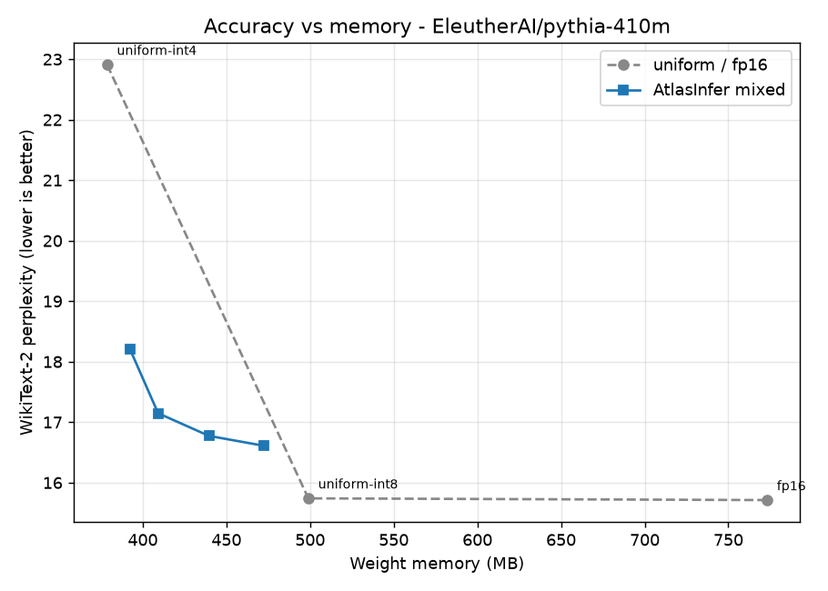
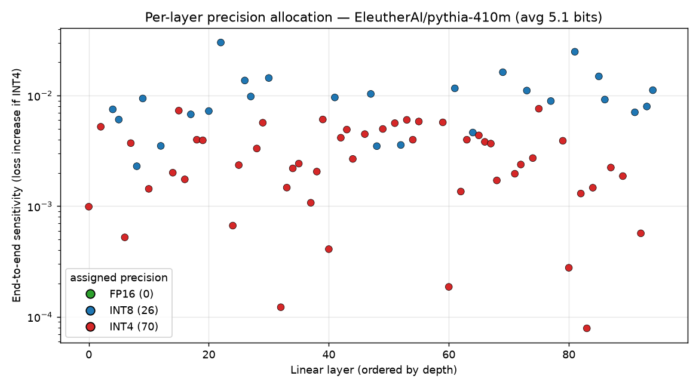

# AtlasInfer

**Mixed-precision quantization for running LLMs on consumer GPUs — from scratch, and benchmarked.**

[](https://github.com/nishantkluhera/AtlasInfer/actions/workflows/ci.yml)


AtlasInfer quantizes each linear layer of a transformer to **FP16, INT8, or INT4
independently**, choosing the precision per layer to **minimize accuracy loss
within a memory budget**. Instead of forcing every layer to the same bit-width,
it measures how much each layer actually suffers under quantization and spends
the budget where it buys the most accuracy.

Everything here — the block-wise integer quantizer, the calibration-based
sensitivity profiler, and the budget allocator — is implemented from scratch on
top of PyTorch (no `bitsandbytes`, no `auto-gptq`), so the whole pipeline is
inspectable in a few hundred lines. There's also an optional **fused W8A16 Triton
kernel** that makes batch-1 decode **1.4–1.6× faster than FP16** (Linux/WSL2).

---

## The result

The headline claim is simple and measured: **at a fixed memory footprint,
per-layer mixed precision is closer to full FP16 accuracy than uniform
quantization.** On Pythia-410M, uniform INT4 costs **+7.2 perplexity**; spending
roughly the same memory but letting AtlasInfer pick precision per layer
(~4.5 bits average) costs only **+2.5** — a ~65% smaller accuracy hit for the
same footprint. Picking precision per layer traces out a strictly better
accuracy-vs-memory frontier than any single uniform bit-width can.



*WikiText-2 perplexity vs. weight memory. The grey line is uniform
quantization (INT4 / INT8 / FP16); the blue line is AtlasInfer's mixed-precision
allocation at several budgets. Lower and to the left is better — the blue curve
sits well below the uniform line, because spending a few extra bits on the most
loss-sensitive layers recovers most of the INT4→FP16 accuracy gap.*

Full numbers for every model are in [Benchmarks](#benchmarks) below and under
[`results/`](results/). All of them are reproducible with one command
(`python benchmark.py --model <name>`).

---

## How it works

A model is quantized in four stages, one module per file:

```
        ┌──────────────┐   ┌──────────────┐   ┌──────────────┐   ┌──────────────┐
weights │  quantizer   │   │ sensitivity  │   │  allocator   │   │   patcher    │ quantized
───────▶│ block-wise   │──▶│ per-layer,   │──▶│ exact budget │──▶│ swap layers  │──▶ model
        │ INT8 / INT4  │   │ per-bit error│   │ assignment   │   │ in-place     │
        └──────────────┘   └──────────────┘   └──────────────┘   └──────────────┘
```

**1. Block-wise integer quantization with sparse outliers** (`quantizer.py`)
Weights are quantized to symmetric INT8 / INT4 with a separate scale per 64–128
element block. The handful of high-magnitude "outlier" weights that dominate a
layer's output (detected per block by z-score) are kept in FP16 and stored
**sparsely** as `(index, value)` pairs — a dense boolean mask would cost a full
byte per weight and wipe out the savings.

**2. End-to-end sensitivity profiling** (`sensitivity.py`)
The key question is *which layers can tolerate aggressive quantization?* The
default profiler answers it directly: for each layer and candidate bit-width it
temporarily swaps in the quantized layer, re-evaluates the model's cross-entropy
on a small calibration set, and records the **increase in loss** that one layer
caused:

```
error(layer, bits) = NLL(model with only this layer quantized) − NLL_fp16
```

This measures a layer's true contribution to output degradation, so the
allocator optimizes the thing we actually care about (perplexity) rather than a
proxy. Switching from a layer-local error proxy to this end-to-end signal cut
the mixed-precision perplexity gap on Pythia-410M by ~4× at the same memory. A
faster activation-local profiler (`SensitivityProfiler.profile`) is also
included for quick experiments.

> Either way, sensitivity is measured on **real calibration activations** — not
> random noise fed through a layer in isolation, a common shortcut that produces
> sensitivity numbers unrelated to how the layer behaves on real text.

**3. Budget-constrained allocation** (`allocator.py`)
Given each layer's `(bytes, error)` options, choosing one precision per layer to
minimize total error under a byte budget is a **multiple-choice knapsack
problem**. AtlasInfer solves it with dynamic programming over a discretized
memory axis — optimal on that grid, whose resolution is far finer than the
per-block scale/outlier overhead the budget already approximates. A greedy
sensitivity-ranked baseline is kept for comparison; the DP beats it whenever the
most *sensitive* layer isn't the most *byte-efficient* to upgrade (covered by a
unit test).



*The allocator's decisions on Pythia-410M at a 5-bit budget: each dot is a linear
layer (y = how much quantizing it to INT4 hurts the model's loss). The most
sensitive layers are kept at INT8 (blue) while the robust majority drop to INT4
(red). It's not a simple sensitivity threshold — the DP also weighs each layer's
byte cost, which is why a few mid-sensitivity but cheap layers stay at INT8.
Generate it with `python examples/04_visualize_allocation.py`.*

**4. In-place patching** (`patcher.py`)
Dense `nn.Linear` (and GPT-2 `Conv1D`) layers are swapped for quantized
equivalents in place. Quantized weights are stored as registered **buffers**, so
`model.to("cuda")` moves them with the rest of the model and they live
persistently on the GPU.

---

## Benchmarks

WikiText-2 perplexity (lower is better) and resident weight memory, measured on
an RTX 3060. `delta vs FP16` is the perplexity increase over the dense baseline.
Reproduce any row with `python benchmark.py --model <name>`.

<!-- RESULTS:gpt2 -->
### gpt2

| Config | Avg bits | Weights (MB) | Perplexity | delta vs FP16 |
| --- | ---: | ---: | ---: | ---: |
| fp16 | 16.0 | 237.4 | 26.494 | +0.000 |
| uniform-int8 | 8.0 | 160.7 | 26.521 | +0.027 |
| uniform-int4 | 4.0 | 127.0 | 28.929 | +2.435 |
| mixed-4.5bit | 4.6 | 131.2 | 28.230 | +1.736 |
| mixed-5bit | 4.9 | 135.2 | 27.908 | +1.414 |
| mixed-6bit | 5.8 | 143.6 | 27.411 | +0.917 |
| mixed-7bit | 6.6 | 152.5 | 27.180 | +0.686 |
<!-- /RESULTS:gpt2 -->

<!-- RESULTS:pythia-410m -->
### EleutherAI/pythia-410m

| Config | Avg bits | Weights (MB) | Perplexity | delta vs FP16 |
| --- | ---: | ---: | ---: | ---: |
| fp16 | 16.0 | 773.1 | 15.712 | +0.000 |
| uniform-int8 | 8.0 | 499.0 | 15.740 | +0.029 |
| uniform-int4 | 4.0 | 378.7 | 22.910 | +7.198 |
| mixed-4.5bit | 4.5 | 392.5 | 18.202 | +2.490 |
| mixed-5bit | 5.2 | 409.2 | 17.147 | +1.436 |
| mixed-6bit | 6.2 | 439.6 | 16.773 | +1.062 |
| mixed-7bit | 7.1 | 472.5 | 16.609 | +0.897 |

At ~4.5 bits — essentially the same footprint as uniform INT4 — mixed precision
cuts the perplexity penalty from **+7.2 to +2.5** (a ~65% reduction) by spending
the extra half-bit on the handful of layers that hurt most.
<!-- /RESULTS:pythia-410m -->

Larger models (e.g. `EleutherAI/pythia-1.4b`) run with the same command — the
mixed-precision advantage grows as the transformer blocks come to dominate the
parameter count over the embeddings.

**Reading the tables:** INT8 is effectively lossless. INT4 is much smaller but
costs real perplexity. The mixed-precision rows land *between* those uniform
points in memory while staying *closer to FP16* in perplexity than the uniform
trade-off line — that gap is what per-layer allocation buys you.

### Runtime: memory vs latency (the honest tradeoff)

The tables above measure *stored* size. The win also shows up at **runtime** —
because only one layer is dequantized to FP16 at a time, peak GPU memory during
generation drops too. But that on-the-fly dequant happens on every matmul with
no fused low-bit kernel, so it costs latency rather than saving it. Measured on
GPT-2, decoding 64 tokens on an RTX 3060 (`python bench_latency.py --model gpt2`):

| Config | Peak GPU (MB) | vs FP16 | tok/s | rel. speed |
| --- | ---: | ---: | ---: | ---: |
| fp16 | 267.2 | 1.00x | 80.2 | 1.00x |
| uniform-int8 | 206.7 | 0.77x | 46.1 | 0.58x |
| uniform-int4 | 177.4 | 0.66x | 26.5 | 0.33x |
| mixed-5bit | 185.4 | 0.69x | 30.3 | 0.38x |

So the trade is **~30% less peak GPU memory for ~2x slower decode** — the right
call when the goal is *running a model that otherwise wouldn't fit*. The fix for
the latency cost is a fused kernel, below.

### Fused INT8 kernel (Triton): turning the memory win into a speed win

[`atlasinfer/triton_kernels.py`](atlasinfer/triton_kernels.py) implements **fused
dequant-GEMM** Triton kernels for both INT8 (`W8A16`) and packed INT4 (`W4A16`):
they read the low-bit weights directly (half / a quarter of FP16's bytes),
dequantize them in-register, and do the matmul in a single pass — no full-weight
materialization. At batch-1 decode (memory-bandwidth bound) both beat FP16.
Measured on an RTX 3060 (`bench_triton_kernel.py`, best-of-3):

| matmul shape (M, K, N) | fp16 | fused W8A16 | fused W4A16 | W8 vs fp16 | W4 vs fp16 |
| --- | ---: | ---: | ---: | ---: | ---: |
| (1, 4096, 4096)  | 0.120 ms | 0.078 ms | 0.080 ms | **1.55x** | **1.51x** |
| (1, 4096, 11008) | 0.297 ms | 0.208 ms | 0.152 ms | **1.43x** | **1.95x** |
| (1, 5120, 5120)  | 0.177 ms | 0.105 ms | 0.101 ms | **1.68x** | **1.76x** |

The edge narrows as batch grows and the matmul becomes compute- rather than
bandwidth-bound (≈1.0–1.4x at M=16), exactly as expected. The W8A16 path is
near-lossless (<1% error); the W4A16 kernel uses per-channel int4 (coarser than
the default block-wise + outlier INT4), so it trades a little accuracy for the
4-bit bandwidth — use it when speed matters most. Triton is Linux/GPU-only, so
this needs **WSL2** on Windows; the module import-guards on `HAS_TRITON` so the
rest of the library is unaffected. See [docs/wsl_triton.md](docs/wsl_triton.md)
for the 3-command setup.

**It's wired into the engine.** `AtlasInference(..., kernel="auto")` (the default)
routes INT8 layers through `W8A16Linear` and INT4 layers through `W4A16Linear`
whenever Triton + CUDA are present, and falls back to the eager block-wise path
everywhere else — so the same code is fast on Linux/WSL2 and still correct on
Windows/CPU:

```python
engine = AtlasInference("gpt2", kernel="auto")   # "on" to force, "off" to disable
```

Both kernel layers carry an eager dequant fallback, so a kernel-quantized model
still runs (just unaccelerated) without Triton.

> Note on the memory floor: token embeddings and the LM head are left in FP16
> (quantizing them hurts accuracy disproportionately), so for a small model like
> GPT-2 they dominate the footprint and mute the headline compression. The effect
> is much larger on models where the transformer blocks, not the embeddings, hold
> most of the parameters.

---

## Install

```bash
git clone https://github.com/nishantkluhera/AtlasInfer.git
cd AtlasInfer

# Install PyTorch for your CUDA version (see pytorch.org), e.g. CUDA 12.1:
pip install torch --index-url https://download.pytorch.org/whl/cu121

# Install AtlasInfer (editable) + benchmark extras
pip install -e ".[benchmark]"
```

## Quickstart

```python
from atlasinfer import AtlasInference

# Uniform INT8 — near-lossless, ~1.5x smaller.
engine = AtlasInference("gpt2")
print(engine.generate("The future of on-device AI is", max_tokens=40))

# Mixed precision within a memory budget (per-layer FP16/INT8/INT4).
engine = AtlasInference("EleutherAI/pythia-410m", memory_budget_gb=0.4)
print(engine.generate("The future of on-device AI is", max_tokens=40))
```

CLI:

```bash
python -m atlasinfer.inference --model gpt2 --prompt "Hello world"
python -m atlasinfer.inference --model EleutherAI/pythia-410m --prompt "Hello" --memory-budget 0.4
```

The [`examples/`](examples/) folder has runnable scripts for basic inference,
the full manual mixed-precision pipeline, layer-sensitivity inspection, and the
per-layer allocation visualization shown above.

## Run the benchmarks

```bash
python benchmark.py --model gpt2
python benchmark.py --model EleutherAI/pythia-410m --eval-tokens 40000 --bits 4.5 5 6 7
```

Outputs a markdown table, a JSON dump, and a perplexity-vs-memory figure under
`results/`.

---

## Project layout

```
atlasinfer/
├── quantizer.py     # block-wise INT8/INT4 + sparse FP16 outliers
├── linear.py        # QuantizedLinear / QuantizedLinear4bit (buffer-backed)
├── sensitivity.py   # calibration-based per-layer error profiler
├── allocator.py     # exact (DP) + greedy budget allocators
├── patcher.py       # in-place layer replacement (nn.Linear & Conv1D)
├── offload.py       # optional CPU<->GPU layer streaming
├── triton_kernels.py# fused W8A16 dequant-GEMM kernel (Linux/WSL2, import-guarded)
└── inference.py     # high-level API + CLI
benchmark.py         # WikiText-2 perplexity / stored-size harness
bench_latency.py     # runtime peak-GPU-memory + decode tok/s harness
bench_triton_kernel.py # fused-kernel microbenchmark (Linux/WSL2)
examples/            # runnable usage scripts
tests/               # pytest suite
docs/wsl_triton.md   # WSL2 setup for the Triton kernel
```

## What this does and doesn't do

- **Two paths, by precision.** The default eager path dequantizes weights to
  FP16 per `matmul` — a memory win at a latency cost (runtime table above). The
  **fused Triton W8A16 kernel** removes that cost and is *faster* than FP16 at
  batch-1 decode (kernel table above), but it's Linux/GPU-only (WSL2 on Windows).
  A note on what *doesn't* work: the obvious shortcut — INT8×INT8 GEMM via
  `torch._int_mm` (W8A8) — measured *slower* than FP16 on this consumer Ampere
  card once activation quant/dequant overhead is counted, and can't do batch-1
  decode, so it isn't used. The fused dequant kernel is the right approach.
- **Where it sits in the literature.** Per-layer, sensitivity-driven mixed
  precision is an established idea (e.g. HAWQ, SqueezeLLM); AtlasInfer is a clean,
  self-contained, from-scratch implementation of it with an *exact* budget
  allocator and reproducible benchmarks — not a new algorithm.
- **Perplexity** is measured on a capped slice of WikiText-2 test for speed; the
  exact token count is a benchmark flag, so absolute numbers shift slightly with
  it while the *relative* ordering (the point of the comparison) is stable.

## Roadmap

- **Done:** fused W8A16 **and** W4A16 Triton kernels (1.4–1.95x over FP16 at
  decode), wired into `AtlasInference` (`kernel="auto"`) so they're used
  automatically when Triton is present — next is folding the block-wise + outlier
  scheme into the W4A16 kernel to close its accuracy gap vs the eager path
- Activation/KV-cache quantization, not just weights
- Hessian- or interaction-aware sensitivity (the current end-to-end signal
  measures one layer at a time and assumes the per-layer losses add up)
- Per-layer outlier-budget as an extra allocation knob

## License

MIT — see [LICENSE](LICENSE).
