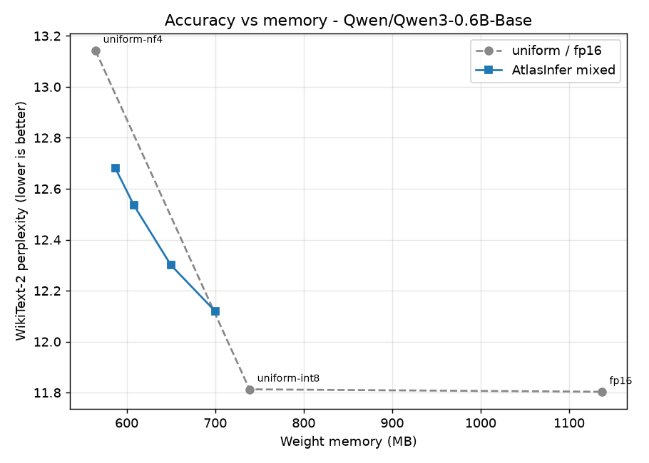
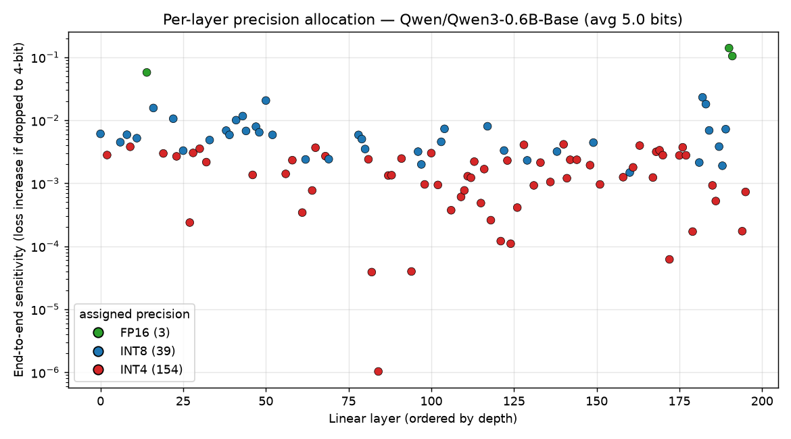

# AtlasInfer

**Mixed-precision quantization for running LLMs on consumer GPUs — from scratch, and benchmarked.**

[](https://github.com/nishantkluhera/AtlasInfer/actions/workflows/ci.yml)


AtlasInfer quantizes each linear layer of a transformer to **FP16, INT8, or 4-bit
(NF4) independently**, choosing the precision per layer to **minimize accuracy
loss within a memory budget**. Instead of forcing every layer to the same bit-width,
it measures how much each layer actually suffers under quantization and spends
the budget where it buys the most accuracy.

Everything here — the block-wise integer quantizer, the calibration-based
sensitivity profiler, and the budget allocator — is implemented from scratch on
top of PyTorch (no `bitsandbytes`, no `auto-gptq`), so the whole pipeline is
inspectable in a few hundred lines. There are also optional **fused W8A16/W4A16
Triton kernels** (Linux/WSL2) where W8A16 beats an FP16 `F.linear` by **1.5–1.97×**
on an isolated batch-1 GEMM.

> **Read that kernel number carefully — it is a single-matmul microbenchmark, not
> decode.** End-to-end generation through the default *eager* path is
> **slower** than FP16 (0.09–0.64×, [measured](docs/benchmarks.md#runtime-memory-vs-latency-the-honest-tradeoff));
> AtlasInfer buys **memory**, and the fused kernels claw back matmul time in
> isolation. End-to-end decode with the fused kernels has not been measured.
> A fuller accounting of what these kernels do and don't achieve — including the
> fact that W4A16 captures only 27–66% of the bandwidth headroom a 4-bit weight
> makes available — is in [PAPER/01_go_nogo.md](PAPER/01_go_nogo.md#2c).

---

## The result

Three measured claims, on **current models** (Qwen3, 2025; Qwen2.5, 2024):

1. **It beats bitsandbytes**, the standard accessible-quant library: AtlasInfer's
   INT8 is lossless and edges LLM.int8(), and at 4-bit its **GPTQ-NF4** path is
   ~3x closer to FP16 than bitsandbytes' NF4 (see [vs bitsandbytes](docs/benchmarks.md#vs-bitsandbytes-the-accessible-quant-baseline)).
2. **GPTQ error compensation closes the 4-bit gap**: on Qwen3-0.6B the 4-bit
   penalty drops from +1.17 (plain NF4) to **+0.51** (GPTQ-NF4) at the *same*
   memory — better than even 5-bit mixed precision (+0.65).
3. **Per-layer mixed precision beats any uniform bit-width** at a given footprint
   — a knob bitsandbytes doesn't have.

On **Qwen3-0.6B**, uniform 4-bit costs **+1.17 perplexity**; GPTQ-NF4 cuts that to
**+0.51** at the same 4 bits, and INT8 is effectively free (**+0.01**). The blue
mixed-precision curve sits strictly below the uniform line:



*WikiText-2 perplexity vs. weight memory on Qwen3-0.6B. Grey = uniform
quantization (NF4 / INT8 / FP16); blue = AtlasInfer's mixed-precision allocation
at several budgets. Lower-left is better — spending a few extra bits on the most
loss-sensitive layers recovers most of the 4-bit→FP16 accuracy gap.*

Full numbers for every model (Qwen3-0.6B, Qwen2.5-0.5B, plus Pythia/GPT-2) are in
[docs/benchmarks.md](docs/benchmarks.md) and under [`results/`](results/), reproducible with
`python benchmark.py --model <name>`.

---

## How it works

A model is quantized in four stages, one module per file:

```
        ┌──────────────┐   ┌──────────────┐   ┌──────────────┐   ┌──────────────┐
weights │  quantizer   │   │ sensitivity  │   │  allocator   │   │   patcher    │ quantized
───────▶│ block-wise   │──▶│ per-layer,   │──▶│ exact budget │──▶│ swap layers  │──▶ model
        │ INT8 / NF4   │   │ per-bit error│   │ assignment   │   │ in-place     │
        └──────────────┘   └──────────────┘   └──────────────┘   └──────────────┘
```

**1. Block-wise quantization with sparse outliers** (`quantizer.py`)
Weights are quantized with a separate scale per 64–128 element block: symmetric
INT8 for the 8-bit tier, and **NF4** (NormalFloat — a 16-level codebook matched
to the Gaussian distribution of weights, from QLoRA) for the 4-bit tier, with
symmetric INT4 also available. The handful of high-magnitude "outlier" weights
that dominate a layer's output (detected per block by a **robust median/MAD
z-score** — when a block holds several comparably large weights they inflate a
plain mean/std together and mask one another under the threshold, whereas
median/MAD tolerates that contamination and still flags them) are kept in FP16
and stored **sparsely** as `(index, value)` pairs — a dense boolean mask would
cost a full byte per weight and wipe out the savings.

**2. End-to-end sensitivity profiling** (`sensitivity.py`)
The key question is *which layers can tolerate aggressive quantization?* The
default profiler answers it directly: for each layer and candidate bit-width it
temporarily swaps in the quantized layer, re-evaluates the model's cross-entropy
on a small calibration set, and records the **increase in loss** that one layer
caused:

```
error(layer, bits) = NLL(model with only this layer quantized) − NLL_fp16
```

This measures a layer's true contribution to output degradation, so the
allocator optimizes the thing we actually care about (perplexity) rather than a
proxy. Switching from a layer-local error proxy to this end-to-end signal cut
the mixed-precision perplexity gap on Pythia-410M by ~4× at the same memory. A
faster activation-local profiler (`SensitivityProfiler.profile`) is also
included for quick experiments.

> Either way, sensitivity is measured on **real calibration activations** — not
> random noise fed through a layer in isolation, a common shortcut that produces
> sensitivity numbers unrelated to how the layer behaves on real text.

**3. Budget-constrained allocation** (`allocator.py`)
Given each layer's `(bytes, error)` options, choosing one precision per layer to
minimize total error under a byte budget is a **multiple-choice knapsack
problem**. AtlasInfer solves it with dynamic programming over a discretized
memory axis — optimal on that grid, whose resolution is far finer than the
per-block scale/outlier overhead the budget already approximates. A benefit-per-byte
greedy (`allocate_greedy`) is kept alongside it as a baseline.

> **Measured caveat:** the exact DP does **not** beat that greedy. Across four
> budgets on Qwen2.5-0.5B they differ by 0.006 ppl on average — 7.5x *inside* the
> spread across random allocations — and the greedy wins at two of the four. What
> buys the accuracy is the measured sensitivity signal (16-43% better than random
> at matched memory), not solving the knapsack optimally. See
> [PAPER/01_go_nogo.md](PAPER/01_go_nogo.md#2f).



*The allocator's decisions on Qwen3-0.6B at a 5-bit budget: each dot is a linear
layer (y = how much quantizing it to 4-bit hurts the model's loss). The most
sensitive layers are kept at INT8 (blue) while the robust majority drop to 4-bit
(red). It's not a simple sensitivity threshold — the DP also weighs each layer's
byte cost, which is why a few mid-sensitivity but cheap layers stay at INT8.
Generate it with `python examples/04_visualize_allocation.py`.*

**4. In-place patching** (`patcher.py`)
Dense `nn.Linear` (and GPT-2 `Conv1D`) layers are swapped for quantized
equivalents in place. Quantized weights are stored as registered **buffers**, so
`model.to("cuda")` moves them with the rest of the model and they live
persistently on the GPU.

---

## Documentation

| | |
| --- | --- |
| [Benchmarks](docs/benchmarks.md) | every measured result: perplexity/memory, vs bitsandbytes, downstream accuracy, kernels |
| [7B on Lightning](docs/lightning_7b.md) | running the suite on a cloud GPU |
| [WSL2 + Triton](docs/wsl_triton.md) | 3-command setup for the fused kernels on Windows |
| [GPU test checklist](docs/gpu_test_checklist.md) | what CI cannot verify, and how to verify it manually |
| [Tech debt](docs/tech_debt.md) | known issues, scored and phased |
| [PAPER/](PAPER/) | the honest write-up: repository audit and a go/no-go analysis that concluded *don't* submit this as a paper |

---

## Install

```bash
git clone https://github.com/nishantkluhera/AtlasInfer.git
cd AtlasInfer

# Install PyTorch for your CUDA version (see pytorch.org), e.g. CUDA 12.1:
pip install torch --index-url https://download.pytorch.org/whl/cu121

# Install AtlasInfer (editable) + benchmark extras
pip install -e ".[benchmark]"
```

## Quickstart

```python
from atlasinfer import AtlasInference

# Uniform INT8 — near-lossless, ~1.5x smaller.
engine = AtlasInference("Qwen/Qwen2.5-0.5B")
print(engine.generate("The future of on-device AI is", max_tokens=40))

# Mixed precision within a memory budget (per-layer FP16/INT8/NF4).
engine = AtlasInference("Qwen/Qwen3-0.6B-Base", memory_budget_gb=0.6)
print(engine.generate("The future of on-device AI is", max_tokens=40))

# Best 4-bit accuracy: GPTQ error-compensated NF4 (needs a tokenizer + calib text).
from transformers import AutoModelForCausalLM, AutoTokenizer
from atlasinfer import quantize_model_gptq, quantize_model_awq
tok = AutoTokenizer.from_pretrained("Qwen/Qwen3-0.6B-Base")
model = AutoModelForCausalLM.from_pretrained("Qwen/Qwen3-0.6B-Base").cuda()
quantize_model_gptq(model, tokenizer=tok)                    # ~3x closer to FP16 than bnb NF4
quantize_model_gptq(model, tokenizer=tok, double_quant=True) # + QLoRA scale compression, same accuracy
quantize_model_awq(model, tokenizer=tok)                     # AWQ: same 4-bit tier, Hessian-free route
```

CLI:

```bash
python -m atlasinfer.inference --model Qwen/Qwen2.5-0.5B --prompt "Hello world"
python -m atlasinfer.inference --model Qwen/Qwen3-0.6B-Base --prompt "Hello" --memory-budget 0.6
```

The [`examples/`](examples/) folder has runnable scripts for basic inference,
the full manual mixed-precision pipeline, layer-sensitivity inspection, and the
per-layer allocation visualization shown above.

## Run the benchmarks

Every harness is seeded (`--seed 0`, deterministic kernels) and writes its table
+ JSON under `results/`, so a number is reproducible run-to-run on the same
hardware.

```bash
# 1. Perplexity / memory sweep (uniform + mixed).
python benchmark.py --model Qwen/Qwen3-0.6B-Base --eval-tokens 40000 --bits 4.5 5 6 7

# 2. Head-to-head vs the 4-bit stack: bitsandbytes + real GPTQ (auto-gptq) + AWQ.
pip install -e ".[baselines]"
python compare_baselines.py --model Qwen/Qwen2.5-0.5B

# 3. Downstream zero-shot accuracy (ARC / HellaSwag / PIQA / WinoGrande), not just perplexity.
pip install -e ".[eval]"
python eval_downstream.py --model Qwen/Qwen2.5-0.5B --limit 1000

# ...or all three, for several models, in one command:
python reproduce.py --models gpt2 Qwen/Qwen2.5-0.5B Qwen/Qwen3-0.6B-Base
```

The external baselines (`auto-gptq`/`gptqmodel`, `autoawq`) and `lm-eval` are
Linux/CUDA-only and version-fragile; each harness **skips any that fail to
import** with a clear note, so a partial install still produces a full table of
whatever's present.

### Bigger models (7–13B) on a cloud GPU

The benchmarks here cap at ~1.4B (6 GB laptop). To go bigger — and to run the
head-to-head against **real bitsandbytes / GPTQ / AWQ** (Linux/CUDA-only, so they
don't install on the Windows dev box) — use a cloud GPU:

- **Lightning AI** (single A100/L4): a priority-ordered runner + hour-budget plan
  in [`docs/lightning_7b.md`](docs/lightning_7b.md) — `bash run_lightning.sh compare`
  gives the AtlasInfer-vs-bitsandbytes head-to-head in ~30 min, across a **spread of
  families** (SmolLM3 / Phi-4-mini / Mistral / OLMo-2 / Qwen3, + gated Llama/Gemma),
  not just one vendor.
- **Kaggle** (free T4×2 / P100): the ready-made
  [`notebooks/kaggle_benchmark.ipynb`](notebooks/kaggle_benchmark.ipynb) clones,
  installs, and runs the full suite. A single 16 GB GPU fits ~≤4B for the FP16
  baseline; **`--device-map`** shards across both T4s for 7–13B:

```bash
python benchmark.py        --model Qwen/Qwen3-8B-Base --device-map
python compare_baselines.py --model Qwen/Qwen3-8B-Base --device-map
```

Two changes make this practical: GPTQ now uses a **block-batched** column update
(≈ group-size× fewer matmuls — minutes instead of hours at 7B) with
**memory-bounded chunked Hessians**, and quantization is **device-preserving** so
each layer stays on its shard. *(Multi-GPU is validated on single-GPU here; Kaggle
T4×2 is the intended test bed — see the notebook.)*

---

## Project layout

```
atlasinfer/
├── quantizer.py     # block-wise INT8 / NF4 / INT4 + sparse FP16 outliers
├── linear.py        # QuantizedLinear / QuantizedLinear4bit (buffer-backed)
├── sensitivity.py   # calibration-based per-layer error profiler
├── allocator.py     # exact (DP) + greedy budget allocators
├── gptq.py          # GPTQ error-compensated NF4 (Hessian-based) + outliers
├── awq.py           # AWQ activation-aware per-channel scaling on the NF4 path
├── double_quant.py  # QLoRA-style double-quantized block scales (--double-quant)
├── codebook.py      # EXPERIMENTAL sub-4-bit vector-quantized codebook (unvalidated)
├── patcher.py       # in-place layer replacement (nn.Linear & Conv1D)
├── offload.py       # optional CPU<->GPU layer streaming
├── triton_kernels.py# fused W8A16/W4A16 dequant-GEMM kernels (Linux/WSL2, guarded)
└── inference.py     # high-level API + CLI
benchmark.py         # WikiText-2 perplexity / stored-size harness
bench_latency.py     # runtime peak-GPU-memory + decode tok/s harness
bench_triton_kernel.py # fused-kernel microbenchmark (Linux/WSL2)
compare_baselines.py # head-to-head vs bitsandbytes (Linux/WSL2)
examples/            # runnable usage scripts
notebooks/kaggle_benchmark.ipynb  # run the suite on bigger models (Kaggle GPUs)
tests/               # pytest suite
docs/wsl_triton.md   # WSL2 setup for the Triton kernel
```

## What this does and doesn't do

- **Two paths, by precision.** The default eager path dequantizes weights to
  FP16 per `matmul` — a memory win at a latency cost (runtime table above). The
  **fused Triton W8A16 kernel** removes that cost and is *faster* than FP16 on a
  batch-1 GEMM (kernel table above — a single-matmul microbenchmark, not an
  end-to-end decode step, which has not been measured), but it's Linux/GPU-only
  (WSL2 on Windows).
  A note on what *doesn't* work: the obvious shortcut — INT8×INT8 GEMM via
  `torch._int_mm` (W8A8) — measured *slower* than FP16 on this consumer Ampere
  card once activation quant/dequant overhead is counted, and can't do batch-1
  decode, so it isn't used. The fused dequant kernel is the right approach.
- **Where it sits in the literature.** The pieces are established ideas —
  sensitivity-driven mixed precision (HAWQ, SqueezeLLM), NF4 + double-quant (QLoRA),
  Hessian-based error compensation (GPTQ), activation-aware scaling (AWQ). AtlasInfer
  is a clean, self-contained, from-scratch implementation that *combines* them (GPTQ
  and AWQ on top of NF4 + sparse outliers + double-quantized scales, under an exact
  budget allocator) with reproducible benchmarks — not a new algorithm, but it lands
  at the GPTQ/AWQ accuracy tier at 4-bit, ahead of the bitsandbytes baseline. For
  **2–3 bit** there's now an *experimental* single-codebook vector-quantization path
  ([`codebook.py`](atlasinfer/experimental/codebook.py)) — implemented and unit-tested, but
  explicitly **not validated at scale** against the AQLM/QuIP#/QTIP frontier (which
  is established on 7B models this repo's 6 GB dev GPU can't run), so no
  SOTA-beating claim is made there.
- **GPTQ is calibration-hungry, memory-heavy, and compute-heavy** — three gotchas
  I hit and fixed. (1) Too few tokens -> rank-deficient Hessian -> compensation
  *hurts* (~1k tokens made 4-bit worse than plain NF4); ~65k tokens (128×512)
  gives the gains above. (2) Holding every layer's Hessian at once OOMs above
  ~0.6B, so the driver uses memory-bounded **chunked** Hessians (also making it
  true *sequential* GPTQ). (3) The naive per-column update is hours at 7B, so it's
  **block-batched** (one matmul per group instead of per column). Together these
  let GPTQ scale from 0.6B to 7–13B (Kaggle T4×2).
- **Perplexity** is measured on a capped slice of WikiText-2 test for speed; the
  exact token count is a benchmark flag, so absolute numbers shift slightly with
  it while the *relative* ordering (the point of the comparison) is stable.

## Roadmap

- **Done:** NF4 codebook for the 4-bit tier (beats bitsandbytes' NF4).
- **Done:** GPTQ Hessian-based error compensation on the NF4 path — takes 4-bit
  to the GPTQ/AWQ tier (Qwen3-0.6B +0.51, Qwen2.5-0.5B +0.48), see above.
- **Done:** AWQ activation-aware scaling on the NF4 path
  ([`awq.py`](atlasinfer/awq.py)) — a second, complementary route to the GPTQ/AWQ
  4-bit tier, from scratch.
- **Done:** double-quantized block scales
  ([`double_quant.py`](atlasinfer/double_quant.py), `--double-quant`) — removes the
  FP32 scale overhead at ~unchanged perplexity, narrowing the 4-bit memory gap to
  bnb.
- **Done:** fused W8A16 **and** W4A16 Triton kernels (1.45–2.62× over FP16 on a
  batch-1 GEMM microbenchmark, WSL2/RTX 3060), wired into `AtlasInference`
  (`kernel="auto"`). End-to-end decode with the kernels is not yet measured.
- **Experimental:** 2–3 bit via a single-codebook vector quantizer
  ([`codebook.py`](atlasinfer/experimental/codebook.py)) — the direction toward the
  AQLM/QuIP#/QTIP frontier; correctness-tested, **not yet validated at scale**.
  Next: residual/additive codebooks and incoherence pre-processing.
- Activation/KV-cache quantization, not just weights.

## License

MIT — see [LICENSE](LICENSE).
